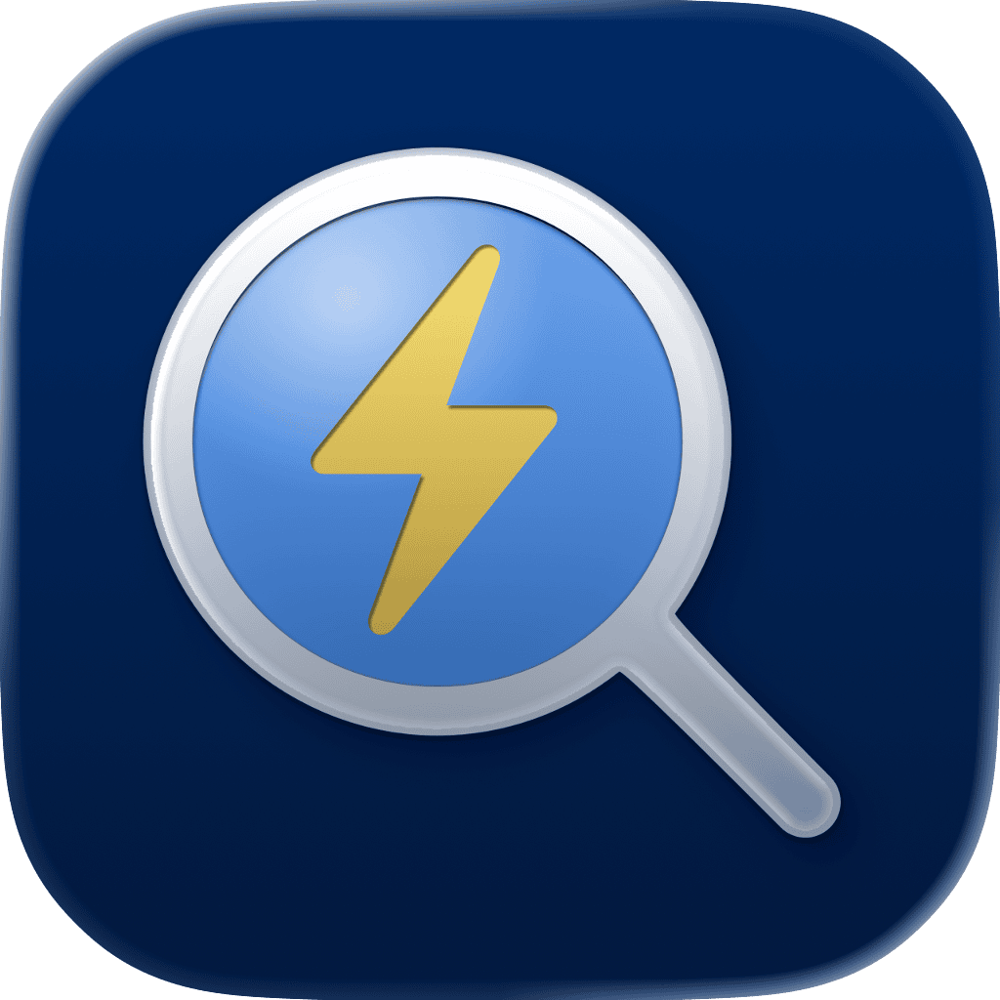

<p align="center">
    
</p>

<p align="center">
    
    
    
    <a href="https://danielsaidi.github.io/QuickSearch"></a>
    <a href="https://github.com/danielsaidi/QuickSearch/blob/master/LICENSE"></a>
    <a href="https://github.com/sponsors/danielsaidi"></a>
</p>


# QuickSearch

QuickSearch is a SwiftUI SDK that lets you type into a `.searchable` text field by just typing, without first having to focus on the text field. It's good for content-based views without any other text fields.

QuickSearch works on all Macs and iPads with a physical keyboard. The `.searchable` text field can be used like a regular text field on devices with no physical keyboard.

Unlike the native `.searchable(text: $query, isPresented: .constant(true))` modifier, QuickSearch doesn't show the input cursor, to avoid draving attention to the search field.


## Installation

QuickSearch can be installed with the Swift Package Manager:

```
https://github.com/danielsaidi/QuickSearch.git
```


## Support My Work

You can [become a sponsor][Sponsors] to help me dedicate more time on my various [open-source tools][OpenSource]. Every contribution, no matter the size, makes a real difference in keeping these tools free and actively developed.


## Getting Started

All you have to do to make QuickSearch work, is to apply `quickSearch: true` to `.searchable`:

```swift
 struct ContentView: View {
 
     @State var query = ""
     @State var text = ""
 
     @FocusState var isTextFieldFocused
    
     var body: some View {
         NavigationStack {
             VStack {
                TextField("Type here...", text: $text)
             }
             .searchable(text: $query, quickSearch: true)
         }
     }
}
```

You can also apply the `.quickSearch` view modifier, to any superview, if you can't access `.searchable`, use custom focus bindings, etc.


## Documentation

The online [documentation][Documentation] has more information, articles, code examples, etc.


## Demo Application

The `Demo` folder has an app that lets you try the library on macOS and on iPads with a hardware keyboard.


## Contact

Feel free to reach out if you have questions or want to contribute in any way:

* Website: [danielsaidi.com][Website]
* E-mail: [daniel.saidi@gmail.com][Email]
* Bluesky: [@danielsaidi@bsky.social][Bluesky]
* Mastodon: [@danielsaidi@mastodon.social][Mastodon]


## License

QuickSearch is available under the MIT license. See the [LICENSE][License] file for more info.


[Email]: mailto:daniel.saidi@gmail.com
[Website]: https://danielsaidi.com
[GitHub]: https://github.com/danielsaidi
[OpenSource]: https://danielsaidi.com/opensource
[Sponsors]: https://github.com/sponsors/danielsaidi

[Bluesky]: https://bsky.app/profile/danielsaidi.bsky.social
[Mastodon]: https://mastodon.social/@danielsaidi
[Twitter]: https://twitter.com/danielsaidi

[Documentation]: https://danielsaidi.github.io/QuickSearch
[Getting-Started]: https://danielsaidi.github.io/QuickSearch/documentation/quicksearch/getting-started
[License]: https://github.com/danielsaidi/QuickSearch/blob/master/LICENSE
